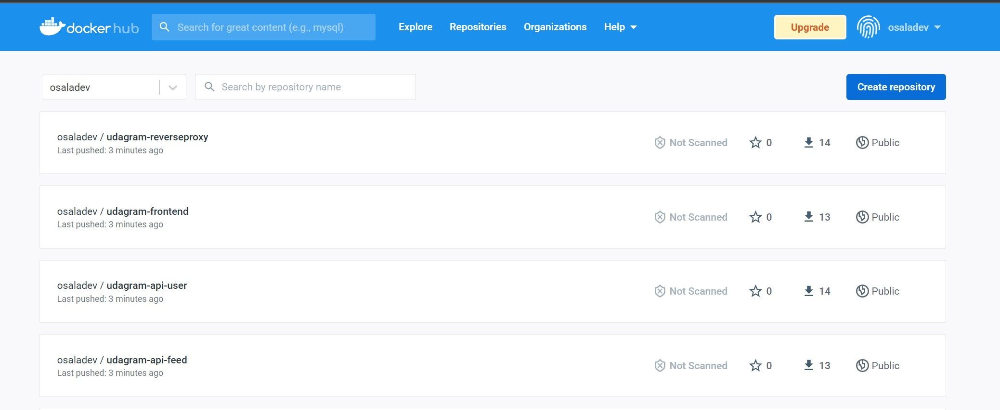
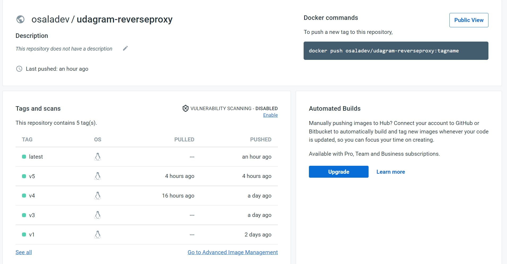
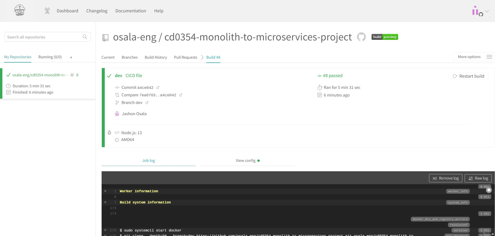
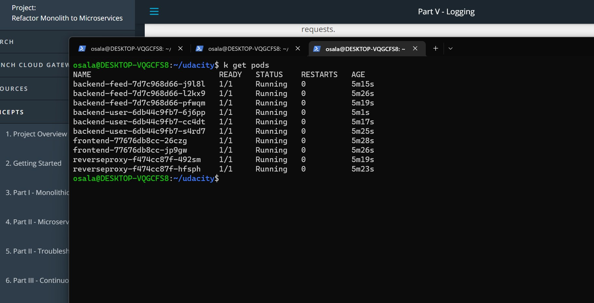
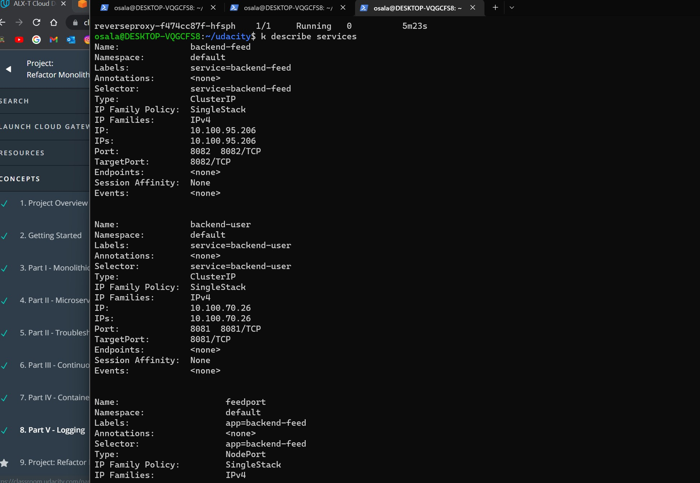
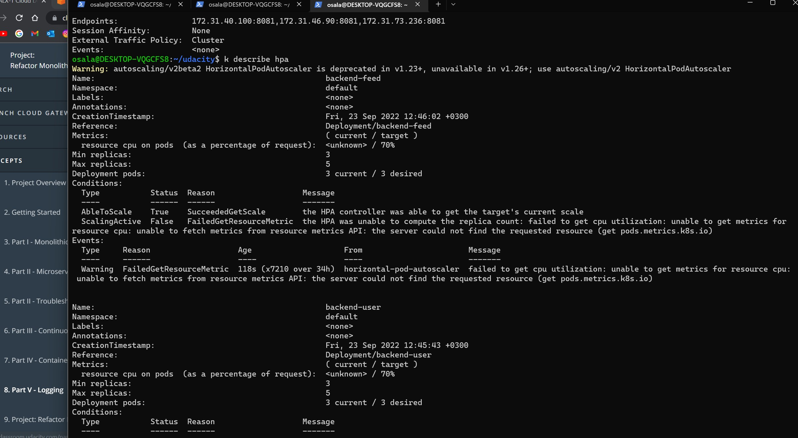
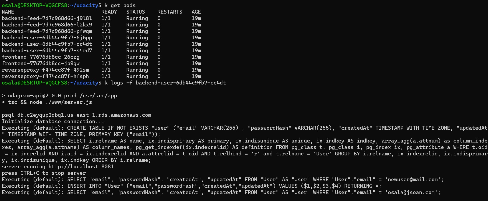
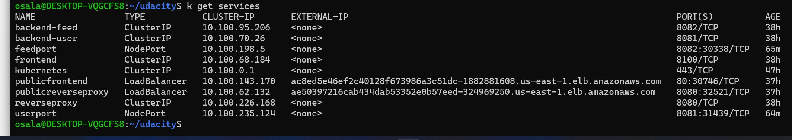

# Udagram Image Filtering Application

Udagram is a simple cloud application developed alongside the Udacity Cloud Engineering Nanodegree. It allows users to register and log into a web client, post photos to the feed, and process photos using an image filtering microservice.

The project is split into two parts:
1. Frontend - Angular web application built with Ionic Framework
2. Backend RESTful API - Node-Express application

## Getting Started
> _tip_: it's recommended that you start with getting the backend API running since the frontend web application depends on the API.

# Submission

## Docker images in your repository in DockerHub

### All repositories



### Single repository


## TravisCI build pipeline showing successful build jobs

### All builds

[!ALL](./screenshots/travisciall.jpg)

### Latest build




## Kubernetes `kubectl get pods` output

```bash
kubectl get pods
```


## Kubernetes `kubectl describe services` output

```bash
kubectl describe services
```


## Kubernetes `kubectl describe hpa` output

```bash
kubectl describe hpa
```


## Kubernetes `kubectl logs <your pod name>` output

```bash
kubectl logs -f backend-user..
```


```bash
kubectl get services
```
